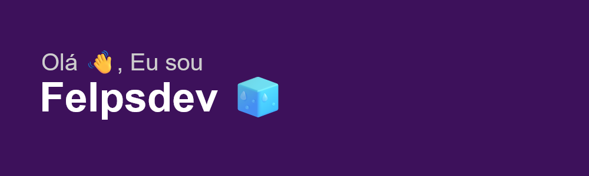

<h3>📋 Sobre Mim</h3>

 <li>💻 Interessado principalmente em desenvolvimento front-end, mas, também, com conhecimento back-end.</li>
 <li>🏦 Envolvido com projetos relacionados a jogos, eventos e startups.</li>
 <li>🌱 Pró-ativo na resolução de problemas e idealização de soluções.</li>

<h3>🧰 Principais tecnologias e ferramentas:</h3>

  
  
  
  
  
  
  
  
  

<h3>🏆 Status no GitHub</h3>
 

  
  

